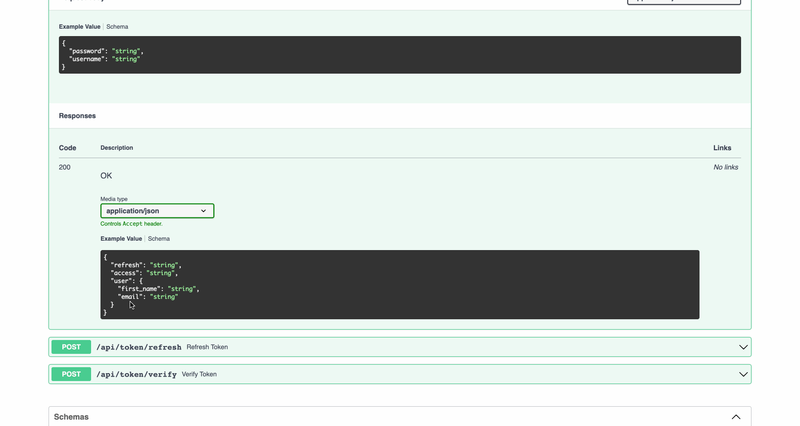

If you wish to customize the claims contained in web tokens which are
generated by the `NinjaJWTDefaultController` and `NinjaJWTSlidingController`
views, create a subclass for the desired controller as well as a subclass for
its corresponding serializer. Here\'s an example :

!!! info
if you are interested in an Asynchronous version of the class, use `AsyncNinjaJWTDefaultController` and `AsyncNinjaJWTSlidingController`.
Also note, it's only available for Django versions that support asynchronous actions.

```python
from ninja_jwt.schema import TokenObtainPairInputSchema
from ninja_jwt.controller import TokenObtainPairController
from ninja_extra import api_controller, route
from ninja import Schema


class UserSchema(Schema):
    first_name: str
    email: str


class MyTokenObtainPairOutSchema(Schema):
    refresh: str
    access: str
    user: UserSchema


class MyTokenObtainPairSchema(TokenObtainPairInputSchema):
    def output_schema(self):
        out_dict = self.get_response_schema_init_kwargs()
        out_dict.update(user=UserSchema.from_orm(self._user))
        return MyTokenObtainPairOutSchema(**out_dict)


@api_controller('/token', tags=['Auth'])
class MyTokenObtainPairController(TokenObtainPairController):
    @route.post(
        "/pair", response=MyTokenObtainPairOutSchema, url_name="token_obtain_pair"
    )
    def obtain_token(self, user_token: MyTokenObtainPairSchema):
        return user_token.output_schema()

```

As with the standard controller, you\'ll also need to include register the controller as shown in `getting_started`

#### Use Django Ninja Router

If you are interested in using functions rather than classes, then you are also covered.
Here is an example

```python
from ninja_jwt.routers.blacklist import blacklist_router
from ninja_jwt.routers.obtain import obtain_pair_router, sliding_router
from ninja_jwt.routers.verify import verify_router
```

Register the `router` to the django-ninja `api` like so:

```python
from ninja import NinjaAPI

api = NinjaAPI()
api.add_router('/token', tags=['Auth'], router=obtain_pair_router)
...
```

If you are interested in customize the token claims, you can do so by creating a subclass of `TokenObtainPairInputSchema` and `TokenObtainPairController`. See [Controller Schema Swapping](#controller-schema-swapping)

Also, its important to note that `NinjaExtra` registers a handler for `APIException` class which is not available in `NinjaAPI` instance.
To fix that, you need the extra code below:

```python
from ninja import NinjaAPI
from ninja_extra import exceptions

api = NinjaAPI()
api.add_router('', tags=['Auth'], router=router)

def api_exception_handler(request, exc):
    headers = {}

    if isinstance(exc.detail, (list, dict)):
        data = exc.detail
    else:
        data = {"detail": exc.detail}

    response = api.create_response(request, data, status=exc.status_code)
    for k, v in headers.items():
        response.setdefault(k, v)

    return response

api.exception_handler(exceptions.APIException)(api_exception_handler)
```

### Controller Schema Swapping

You can now swap controller schema in `NINJA_JWT` settings without having to inherit or override Ninja JWT controller function.

All controller input schema must inherit from `ninja_jwt.schema.InputSchemaMixin` and token generating schema should inherit
from `ninja_jwt.schema.TokenObtainInputSchemaBase` or `ninja_jwt.schema.TokenInputSchemaMixin` if you want to have more control.

Using the example above:

```python
# project/schema.py
from typing import Type, Dict
from ninja_jwt.schema import TokenObtainInputSchemaBase
from ninja import Schema
from ninja_jwt.tokens import RefreshToken

class UserSchema(Schema):
    first_name: str
    email: str


class MyTokenObtainPairOutSchema(Schema):
    refresh: str
    access: str
    user: UserSchema


class MyTokenObtainPairInputSchema(TokenObtainInputSchemaBase):
    @classmethod
    def get_response_schema(cls) -> Type[Schema]:
        return MyTokenObtainPairOutSchema

    @classmethod
    def get_token(cls, user) -> Dict:
        values = {}
        refresh = RefreshToken.for_user(user)
        values["refresh"] = str(refresh)
        values["access"] = str(refresh.access_token)
        values.update(user=UserSchema.from_orm(user)) # this will be needed when creating output schema
        return values
```

In the `MyTokenObtainPairInputSchema` we override `get_token` to define our token and some data needed for our output schema.
We also override `get_response_schema` to define our output schema `MyTokenObtainPairOutSchema`.

Next, we apply the `MyTokenObtainPairInputSchema` schema to controller. This is simply done in `NINJA_JWT` settings.

```python
# project/settings.py

NINJA_JWT = {
    'TOKEN_OBTAIN_PAIR_INPUT_SCHEMA': 'project.schema.MyTokenObtainPairInputSchema',
}
```
Other swappable schemas can be follow as shown below:
```python
# project/settings.py

NINJA_JWT = {
    # FOR OBTAIN PAIR
    'TOKEN_OBTAIN_PAIR_INPUT_SCHEMA': "project.schema.MyTokenObtainPairInputSchema",
    'TOKEN_OBTAIN_PAIR_REFRESH_INPUT_SCHEMA': "for.obtain_pair.refresh_input.schema",
    # FOR SLIDING TOKEN
    'TOKEN_OBTAIN_SLIDING_INPUT_SCHEMA':  "for.obtain_sliding.input.schema",
    'TOKEN_OBTAIN_SLIDING_REFRESH_INPUT_SCHEMA': "for.obtain_pair.refresh_input.schema",

    'TOKEN_BLACKLIST_INPUT_SCHEMA':  "for.blacklist_input.schema",
    'TOKEN_VERIFY_INPUT_SCHEMA':  "for.verify_input.schema",
}
```



!!! Note
   `Controller Schema Swapping` is only available from **v5.2.4**
